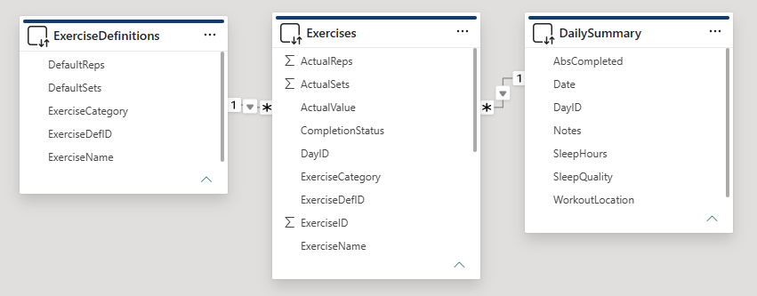

# WorkoutDB — Personal Fitness Tracking Application

**Stack:** C# (ASP.NET Core Minimal API), Azure SQL Database, Azure App Service, Chart.js, T-SQL

**Status:** Deployed and in active use

## Overview

A full-stack workout tracking application built from scratch with no prior C# experience, using AI-assisted development to accelerate learning. Planned and managed solo using Scrum methodology —> full Product Backlog, Sprint Backlog, and Definition of Ready/Done written before any code.

## Problem

Workout tracking in Excel had hit its limits:
- Fixed columns per exercise (couldn't adapt when the routine changed)
- No way to track partial completion (fewer sets/reps than planned)
- Manual, error-prone data entry (scrolling a spreadsheet mid-workout)
- Growing null values with no clear structure (different exercises performed every day)

## Data Model

Normalized relational schema in Azure SQL Database:

| Table | Purpose |
|---|---|
| `DailySummary` | One row per day: sleep hours, sleep quality, abs completion, notes |
| `Exercises` | One row per exercise performed: links to a day, tracks actual vs. planned sets/reps/weight |
| `ExerciseDefinitions` | Reusable exercise templates: name, category, default sets/reps |

**Relationships:** `DailySummary` (1) → (many) `Exercises` on `DayID` ;  `ExerciseDefinitions` (1) → (many) `Exercises` on `ExerciseDefID`



## Architecture

```
Browser (phone or desktop)
   ↓
ASP.NET Core Minimal API (C#)
   ↓
Azure SQL Database (WorkoutDB)
   ↓
Chart.js dashboards (rendered client-side from JSON API endpoints)
```

Hosted on Azure App Service, so it's accessible from any browser, which means no local network or Remote Desktop workaround needed.

## Features

- Log actual vs. planned sets, reps, and weight per exercise
- Multi-exercise entry in a single form submission
- Duplicate exercise prevention
- Workout location tracking (dropdown)
- Daily summary: sleep hours, sleep quality, abs completion
- Two in-app dashboards:
  - **Overview** (`/dashboard`) — trends across all workouts
  - **Per-exercise** (`/dashboard/exercise`) — progression on a single lift

## Design Decisions & Pivots

- **Power BI → in-app dashboards:** Started with Power BI, but its mobile app requires a work/school Microsoft account. Rebuilt the dashboards directly in the ASP.NET app with Chart.js instead — one less moving part, and works on any phone browser.
- **Row-based exercise tracking:** Avoided a fixed column per exercise so the schema stays flexible as the routine changes over time.
- **Planning before code:** Wrote a 21-story Product Backlog across epics, plus Sprint Backlog and Definition of Ready/Done, before writing any C#.

## SQL Highlights

`[Add 2-4 representative queries here — e.g. the dashboard aggregation query, the PR/progress calculation, the data-cleaning script that backfilled nulls and normalized exercise names]`

## Development Approach

- Solo Scrum: Product Backlog → Sprint Backlog → sprint execution, tracked on a formula-driven Kanban board (Excel `FILTER`/`VSTACK`)
- Iterative, AI-assisted build — one feature/bug at a time
- Legacy Excel data cleaned via T-SQL (null backfill, name normalization, category corrections) before import

## Repo Structure

```
WorkoutDB/
├── README.md
├── src/               # ASP.NET Core source (C#)
├── sql/               # Schema creation + key T-SQL queries
├── docs/              # ER diagram, architecture notes
└── screenshots/       # Dashboard and app UI
```

## Live App


## What I Learned

- Building a relational schema from scratch and normalizing it as requirements changed
- ASP.NET Core minimal API design and deployment to Azure App Service
- Azure networking/firewall configuration (rules live at the server level, not the database)
- Applying Scrum discipline to a solo project
